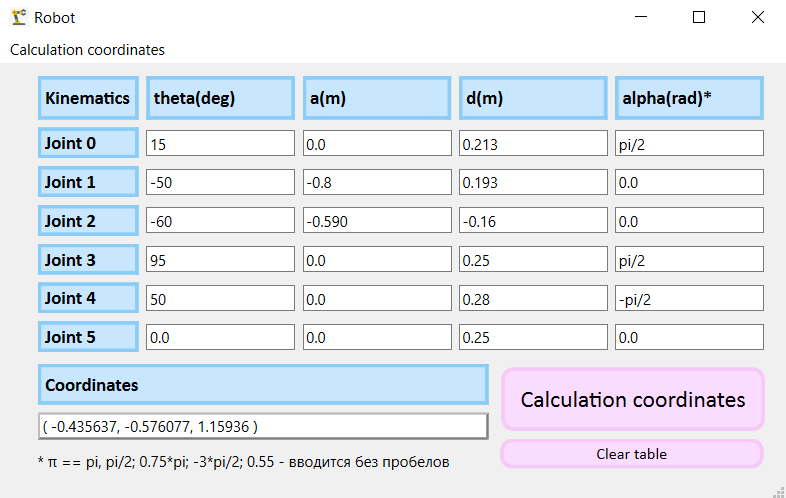

# Robot

В данном рерозитории содержится реализация задачи прямой кинематики 6-осевого коллаборативного робота в виде GUI-приложения на C++ с использованием библиотеки Qt (QWidgets).

Дана DH-модель (Денавит-Хартенберг) для 6-осевого робота. Каждое сочленение манипулятора характеризуется набором параметров DH, таких как угол поворота (θ - theta), смещение по оси (d), смещение по расстоянию (a) и угол наклона между осями (α - alpha). Основная цель состоит в разработке алгоритма прямой задачи кинематики, который на основе набора параметров вычисляет конечное положение манипулятора (координаты x,y,z) в пространстве.

